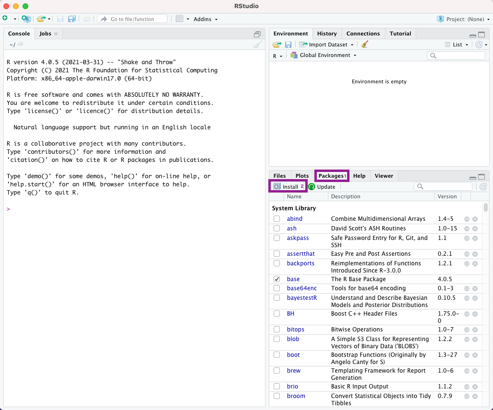
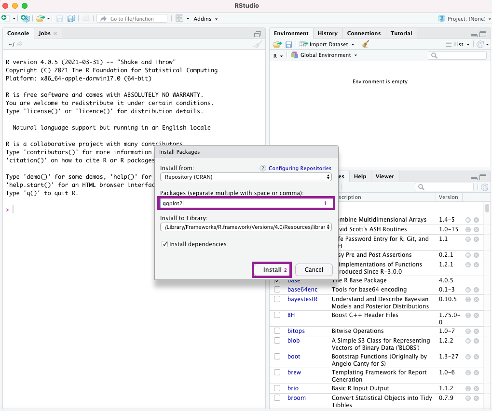

# Getting Started {#intro}

## Setting up R
You need to have access to [R](https://www.r-project.org/) for this course. You can download R for free from [CRAN](https://cran.r-project.org/).

R is available for Windows, Mac OS and Linux as well as some less common platforms.

You can download the standard version of R from [CRAN](https://cran.r-project.org/).

### Downloading and installing R for Windows
To download the Windows installer of R, just enter the following URL (or click on the clink).

https://cran.r-project.org//bin/windows/base/release.html 

This will download the most installer for the most recent version of R. Alternatively, you can go to the main CRAN page, https://cran.r-project.org/, and then click on "Download R for Windows", click on "base" and then on "Download R x.y.z for Windows" (where x.y.z is the current version number of R). 

You can then run the installer, accepting all default settings. 


### Downloading and installing R for Mac
To download the Windows installer for Mac, just enter the following URL (or click on the clink).

https://cran.r-project.org/bin/macosx/

From here, select the most recent version of R and the .pkg file will automatically download. This file will be in the form "R-x.y.z" (where x.y.z is the current version number of R). 

Once the file is opened, the installer will open and you can select the default settings.

## RStudio
It is recommended that you also download and install [RStudio Desktop](https://www.rstudio.com/products/rstudio/download/), a powerful [integrated development environment (IDE)](https://en.wikipedia.org/wiki/Integrated_development_environment) for R. RStudio contains a much better code editor. It has, for example, [syntax highlighting](https://en.wikipedia.org/wiki/Syntax_highlighting), i.e. it will automatically display your code in different colours to make it easier and quicker to read the code. Even though other IDEs, such as [Eclipse](http://www.walware.de/goto/statet), [Visual Studio Code](https://code.visualstudio.com/),  or [Emacs](https://ess.r-project.org/) can also be used with R, RStudio is by far the most popular among R users.

RStudio is just a front-end for R, so to be able make use of RStudio, you need to also have R installed.

RStudio Desktop Open Source is available for free from [RStudio](https://rstudio.com).


### Installing RStudio for Windows/Mac
Go to 

https://www.rstudio.com/products/rstudio/download/

and scroll down to the section "All installers", then click on "RStudio-x-y-z.exe" in the first row of the table for a Windows install, or click on "RStudio-x-y-z.dmg" for a macOS install. This should start the download of the RStudio installer. 

You can then run the installer, accepting all default settings (for macOS, you will need to drag and drop the application into the applications folder once open). 

## R packages

R comes with a default selection of packages, which should cover your "basic needs" in terms of data management, data visualisation and modelling. However, there is a large selection of "add-on" R packages available on CRAN, some of which we will use in this course. You can only use these R packages once you have installed them.

Imagine you want to use an R package called `ggplot2` (which we will use later in this course). In order to be able to use it, you first need to install it. You can do so by entering

```{r,eval=F}
install.packages("ggplot2")
```

into R. This will download and install the package `ggplot2`, as well as any other packages `ggplot` uses.

Alternatively, you can click on the tab "Packages in the bottom-right panel, and then click on "Install".


```{r install1, echo=F,fig.align="center",out.width="85%",fig.cap="Selecting the installation menu for installing packages"}

```


You can then enter the name of the package you want to install and click on "Install"

```{r install2,echo=F, fig.align="center",out.width="85%",fig.cap="Installation menu for packages"}

```


Once you have installed an R package, you can load it using the function `library`

```{r,eval=F}
library(ggplot2)
```


