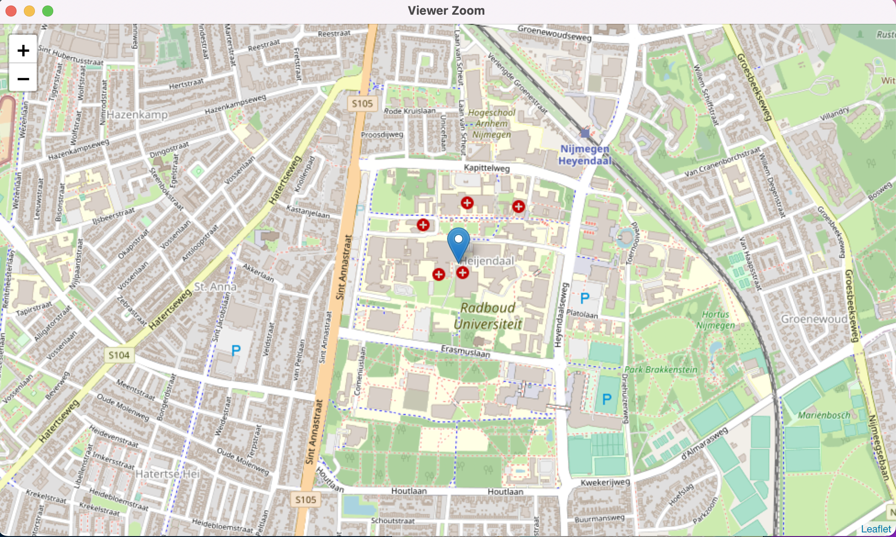
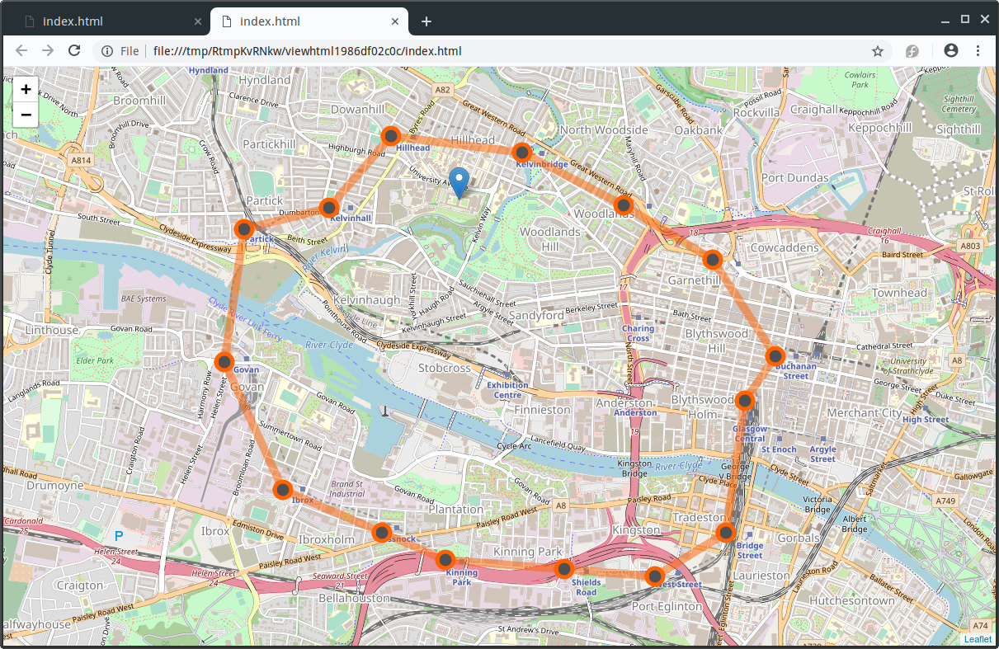

# Producing maps for plotting

## Producing maps using ggmap

The R package `ggmap` can download maps from Google maps (or OpenStreetMap) which can then be used as a background layer in a `ggplot2` plot.

The function `get_map(location, zoom)` downloads a map. `location` can be a pair of longitude and latitude, a character string describing the location, or a bounding box. `zoom` controls the zoom level (from 3 (continent) to 21 (highest resolution)). The optional argument `maptype` can be used to select the type of map downloaded (for example `"roadmap"`, `"hybrid"` or `"satellite"` when using Google maps)

Note that access to the Google API (for Google map tiles and for geolocation (translation of location description to GPS coordinates) requires a Google API key. When using a bounding box and `"stamen"` as `source`, no API key is required.

```{r, message=FALSE, results="hide"}
library(ggmap)
boundingbox <- c(left = 5.855, bottom = 51.817, right = 5.871, top = 51.826)
map <- get_map(boundingbox, zoom=16, source="stamen")
```

The map can the be plotted using `ggmap(map)`. Layers can be added to the map using the usual `ggplot2` commands.
```{r, dev.args=list(pointsize=10)}
ggmap(map) + 
    geom_label(x=5.862, y=51.823, label="Radboud University") 
```
 
### Task
In this task, we will use data from two tibbles, `stations` and `trips`. These contain information on the list of bike stations of the Bay Area Bike Share system in the San Francisco Bay Area. 

You can download the data using the following command

```{r}
load(url("https://github.com/UofGAnalyticsData/R/raw/main/Week%206/t3.RData"))
```

It has the following columns.


| Column name | Description                    |
|-------------|--------------------------------|
|      `station_id` |  Numeric identifier of the station|
|      `name`       |  Name of the station|
|      `lat`        |  Latitude of the station|
|      `long`       |  Longitude of the station|
|      `dockcount`  |  Number of docks at the station|
|      `city`       |  City in which the station is located|
  

The tibble `trips` contains all trips made during August 2015. It has the following columns.

| Column name | Description                    |
|-------------|--------------------------------|
|      `trip_id`           | Numeric identifier of the trip|
|      `trip_duration`     | Duration of the trip in seconds|
|      `day`               | Day of the month the trip was started|
|      `hour`              | Decimal hour when the strip was started|
|      `start_station_id`  | Numeric identifier of the station where the trip started|
|      `end_station_id`    | Numeric identifier of the station where the trip ended|
|      `bike_id`           | Numeric identifier of the bike used|
|      `end_date`          | Date and time the trip ended|
|      `subscriber_type`   | User type (“Subscriber” or “Customer”)|


a) Plot the locations of each of the bike stations. You can use the following bounding box below for your map
```{r}
boundingbox <- c(left = -122.5, bottom = 37.25, right = -121.75, top = 38)
```

b) (Harder) For trips within the city of San Francisco, use the code below to create an origin-destination matrix. The $(i,j)$th entry contains the number of trips from station $i$ to station $j$. 

Create a plot representing the number of trips between the stations. Use the line thickness or transparency to indicate the number of trips. You can use the following bounding box below for your map

```{r}
library(tidyverse)

sf_stations <- stations %>%
    filter(city=="San Francisco") 

od <- trips %>%
         filter(start_station_id%in%sf_stations$station_id,
                end_station_id%in%sf_stations$station_id) %>%
         group_by(start_station_id, end_station_id) %>%
         summarise(ntrips=n()) 

odm <- od %>%
         spread(end_station_id, ntrips, fill=0) 

odm <- as.matrix(od[,-1])
rownames(odm) <- od$start_station_id

od2 <- od %>% 
    full_join(od, by=c("start_station_id"="end_station_id", "end_station_id"=
"start_station_id")) %>%
    replace_na(list(ntrips.x=0, ntrips.y=0)) %>%
    mutate(ntrips=ntrips.x+ntrips.y) %>%
    select(-ntrips.x, -ntrips.y) %>%
    filter(start_station_id<end_station_id)

odall <- 
    od2 %>% 
    inner_join(sf_stations, by=c("start_station_id"="station_id")) %>%
    inner_join(sf_stations, by=c("end_station_id"="station_id"), suffix=c("","_end"))


boundingbox <- c(left = -122.43, bottom = 37.76, right = -122.38, top = 37.81)
```

### Answer
For part (a) we can use the following code.

```{r, message=FALSE, results="hide"}
boundingbox <- c(left = -122.5, bottom = 37.25, right = -121.75, top = 38)

map <- get_map(boundingbox, zoom=9, source="stamen")

ggmap(map) + 
    geom_point(data=stations, aes(x=long, y=lat,  colour=city)) +
    xlab("Longitude") + ylab("Latitude") + 
    ggtitle("Bicycle stations in the San Francisco Bay Area")
```
	
For part (b) we can use the following code.


```{r, message=FALSE, results="hide"}
library(magrittr)
boundingbox <- c(left = -122.43, bottom = 37.76, right = -122.38, top = 37.81)
map <- get_map(boundingbox, zoom=13, source="stamen")


ggmap(map) + 
    geom_point(data=sf_stations, aes(long, lat, size=dockcount), col="orange") +
    geom_segment(data=odall, aes(long, lat, xend=long_end, yend=lat_end, alpha=ntrips), col="orange")+
    xlab("Longitude") + ylab("Latitude") + 
    ggtitle("Bicycle trips in San Francisco")
``` 


### Producing maps using leaflet

Maps plotted using `ggmap` cannot be panned and zoomed in and out  like maps on Google Maps or OpenStreetMap. The package `leaflet` allows for this. It works somewhat the other way round than `ggmap`: rather than downloading the map and integrating it into an R plot it overlays the data over the map interface. 

The following command puts a marker where Radboud University is located.
```r
library(leaflet)
leaflet() %>%
   addTiles(urlTemplate = "http://{s}.tile.openstreetmap.org/{z}/{x}/{y}.png") %>% 
   addMarkers(lng=5.862, lat=51.823, popup="Radboud University")
```
The argument `urlTemplate` is only required when opening the file locally.




Lines can be added to the map using the function `addPolylines`. 

The data frame `subway`  contains the GPS coordinates of all subway stations in Glasgow. You can produce a map of the Glasgow subway network using the following code. (You should have access to this data frame from the previous download).
```r
subway2 <- rbind(subway, subway[1,])     # Make sure line goes back to Hillhead
leaflet() %>%   
   addTiles(urlTemplate = "http://{s}.tile.openstreetmap.org/{z}/{x}/{y}.png") %>% 
   addMarkers(lng=-4.2885, lat=55.8715, popup="The University of Glasgow") %>%
   addPolylines(subway2$long, subway2$lat, color="#ff6200", opacity=0.5, weight=10) %>% 
   addCircleMarkers(subway$long, subway$lat, popup=subway$station, color="#ff6200", 
                    opacity=1, fillColor="#4d4f53", fillOpacity=1) 
```




